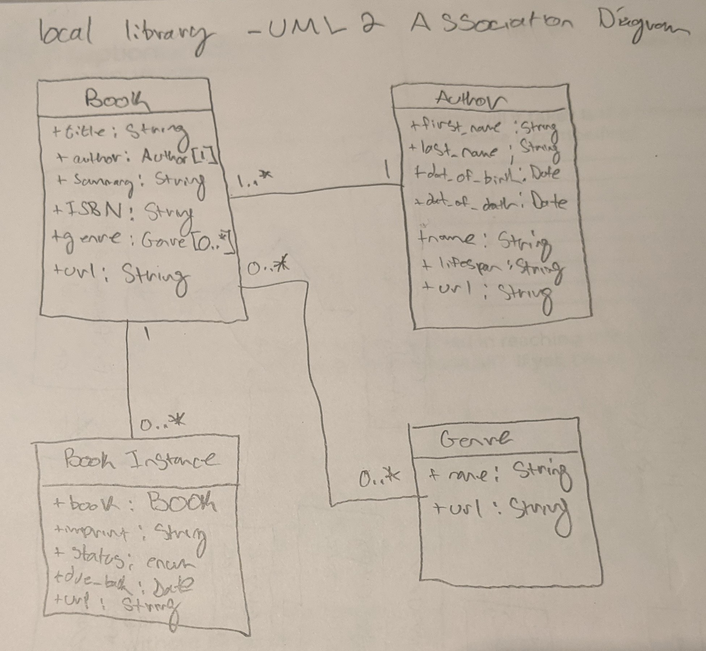
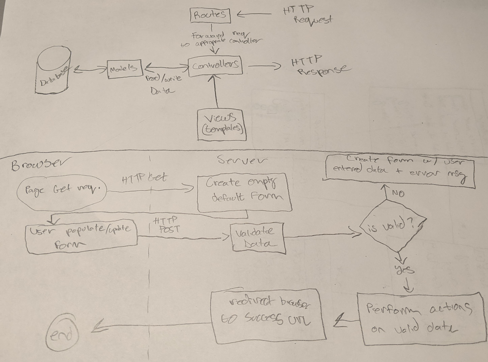

# Express Local Library
Implemented a local library website using Node/Express and MongoDB(Microsoft Azure). Followed the Mozilla Developer Network Back End Documentation.

## Main Take Aways:
- Routing
- Controllers
- Creating a Mongo Database
- Data Models
- Serving Static view templates and CSS files
- Form validation and sanitization

Hosted on Heroku [Here](https://morning-peak-74909.herokuapp.com/catalog)

## Unified Modeling Language (UML 2) Diagram 

## Client Request and System Response Diagrams

